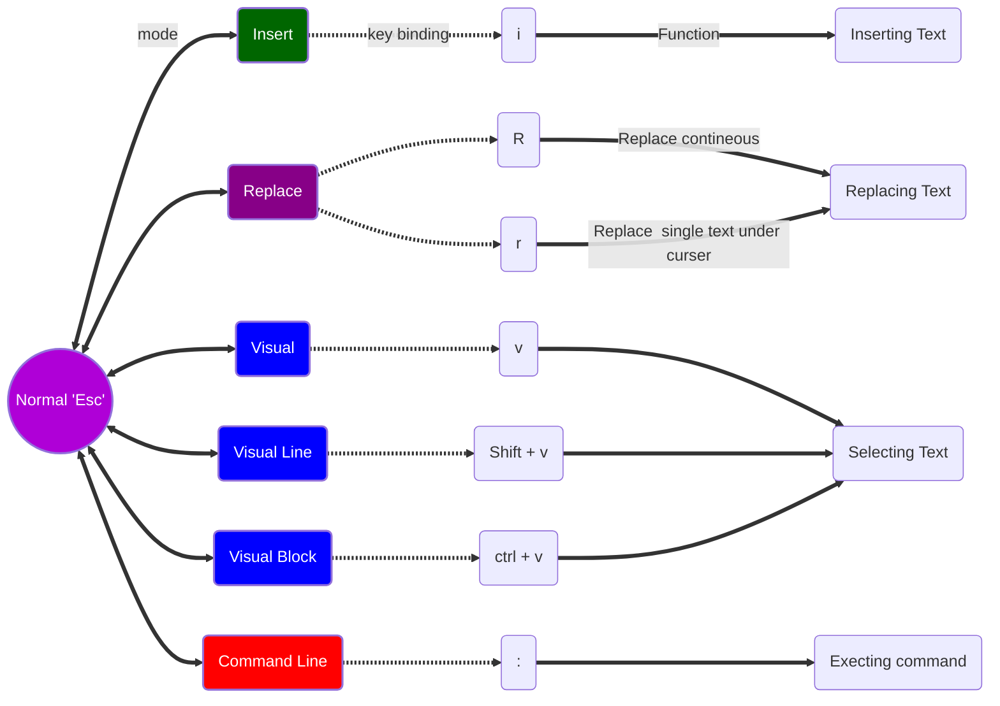

# VIM[^1]
[^1]: This tutorial applicable to nvim some extent.

Vim is a modal editor.


[](https://postimg.cc/PLYS82x5)

**undo in vim: `u`**
**redo in vim: `ctrl r`**
# Let’s start

Start program typing : `vim`

`vim filename.md` :Open a file
`q` : quit file if we’re not make any changes.
`q!` : quit file with out saving any changes
`w` : write/ save the file with changes
`wq` : save and quit the file.
`x` : save and quit the file.

<h4 style="color:red;">**NORMAL MODE**</h4>

**NORMAL**
`x`:Delete a text.
<h5 style="color:blue;">Navigation:</h5>

_Navigation:_
 
 `h`:LEFT
 `l` : RIGHT
 `k` :UP
 `j`:DOWN
 `w`:Move cursor forward by one word.
 `W` :Move to next word ignoring special character.
 `b` :Move cursor backward by one word.
 `B` : Move backward one word ignoring special character.
 
 `e`: Move end of word.
 `$`: Move end of line.
 `99l`: Move end of Line.
  `0` :Move beginning of line
`99h` : Moving beginning of line.
 `caret` :Move to first non empty character of line.
 ` ctrl u`:Move up.
 `ctrl d` :Move down.
 
 `G` :All the way down.
 `gg`:All the way up.
`<line number > G` : To go to perticalar line.
 `1%` :To go to top of file.
 `100%`:To go to bottom of file.
 
 `L`:Lowest line of the screen :
 `M`:Middle of Screen:
 `H`:Highest line of Screen:
 
 Find: `f <char>` : you are in a line want to move to word “owl” you need to press in normal mode: `fo`
 
 For back word : `F<char>`
 
 Similarly you can you `t` and `T` just  before the letter, forward and backward respectively.
 
 
 
 
 
 

**INSERTMODE**

TO ENTER IN TO INSERT MODE : `i`

BACK TO NORMAL MODE :`<esc>`

Editing COMMANDS:

`o`: opens a new line below my curser
`O` : opens a new line above my curser
`a` : append insert mode after the character.
`A` : append insert mode end of line.
`.` : repeats previous editing command
Deleting key `d` binding with movement commands

`dw` : Delete the word
`dd` :Delete line
`de` : Delete to end of word
_When the curser is beginning of line_
`<Linenumber  > D` : delete that number of line, you can paste later.
`999D` : delete everything.


>Note : `Y` : yanks entire line
>       `D` : deletes from curser to end of line.
>       `C` :change from curser to end of line.


<h4 style="color:red;">**CHANGE COMMAND**</h4>

**CHAGE COMMAND:** `c` followed by bind and put you in insert mode. Take motion as arguments

`ce` : change up to end of word
`cc` : delete the line then insert mode.
`cw` : change the word, while cursor is on first letter.
`ciw` : change in word, irrespective cursor on character of word.
`x` : detele that perticular character
`r` : replace the particular character
`~` : change the case of single character.
`R` : replace until pressing <esc>
 **COPY AND PASTE**
 
 `y` : copy take motion as argument
 `yy` : copy the line.
 `yw` : copy the word
 `2Y` : Three lines yanked
 `p` : paste below the line
 `P` : paste above the line
 
<h4 style="color:red;">**COMMAND MODE**</h4>

**COMMAND LINE MODE**

ENTER IN TO COMMAND LINE MODE: `:`

BACK TO NORMAL MODE: `<esc>`

After pressing `:` in normal mode, you can type and enter commands as usual.

Quit : `:q` or `:quit`

Save a file : `:w`

Help : `:help :w` to find help for particular key.

> Vim has separate tabs and windows

Opening a tab: `:tabnew`

closing tab: `:q`

Closing all windows :`:qa`

`:<arrow up key>` : show previous command.
<h4 style="color:red;">**VISUAL MODE**</h4>

**VISUAL MODE (REGULAR) <`v`>**

Use regular mode command to move your pointer.

Once you select. Press `y` it copies and come back to normal mode

`i”` : To select with in double quotes.
In visual mode when we yank the text between “.

We cannot paste same text more than once as every time we paste new text saved in buffer.
<h4 style="color:red;">**VISUAL LINE MODE**</h4>

**VISUAL LINE MODE <`V`>**

Select whole line
 <h4 style="color:red;">**VISUAL BLOCK MODE**</h4>
 
**VISUAL BLOCK MODE <`ctrl v`>**

Selecting block of character as a column. When press `I` insert more, when we write something new, it changes in all the block at once:

`I` : inserts to the left of visual block.
`A` :appends to the right of the visual block.
`c` :to change the visual block.
`d` :to delete the visual block.
`o` :change of corner in visual block mode.
<h4 style="color:red;">**COUNTS**</h4>

**COUNTS:**

`4j` : it does j four times
`7dw` : delete 7 lines

<h4 style="color:red;">**MODIFIER**</h4>

**MODIFIER:**( i : i for in)

[strong word]: `ci[` put me insert mode after deleting the bracket.
`da[`: delete everything include parenthesis.
`ciw` : change in word, irrespective cursor on character of word.
 
 We can use this for yank also
 
 `yi(` : yank everything with in the bracket.
 This also works for tags.
 
<h4 style="color:red;">**INDENT,REPEAT AND TAB**</h4>

**INDENT,REPEAT AND TAB**
 It follows the <number><verb><noun> rule.[NORMAL MODE]

` > h` or `> l` :indent to the write
`>>` : indent the current line RIGH
`<<` : indent the current line LEFT

`>j` : indent current and line below.

`< j` : outdent current and line below.

`2>2j` : indent four line.
`.` : repeat any command

> IN VISUAL MODE WE TO PRESS `>` ONE TIME FOR INDENT

> IN INSERT MODE PRESS `TAB` KEY.
> `^I` is the tab character. (:set list)

***check vim is checking file type***
`:filetype`
Set in .vimrc

auto format example

`vi{` : selection and then pressing `==` equal.

Select the lines for auto indent And press `==` .

>Auto indent gets from a file `:e $VIMRUNTIME/indent`
>To see the file which used `:scriptnames` 
>


<h4 style="color:red;">**SEARCH**</h4>

**SEARCH**

`* `: search for the word the cursor is on.

`n` : To find next occurrence.
`N` : To find backward next occurrence.
`#` : backward search for the word cursor is on.
`:/searchword` : all the searchword highlighted.
`:?searchword` : search upward
`:/\cdatabase` : ignore case.
`:/\Cdatabase` : case sensitive.
`:\/<in\>`   : search particular word
`:/\/\*\*`    : search for special character.
`:/<arrow up key> `: show previous search.
`:?<arrow up key>` : Show previous search in reverse order.
`q/` : show search history.
`q/` :show reverse history.
`:q` : To quit out of this.
`q:` : show the command history.

<h4 style="color:red;">**SEARCH AND REPLACE**</h4>

**SEARCH AND REPLACE**
`:4,7s/two/VIM` : from line 4 to 7 search word “two” and replace with “VIM”. works in _first occurrence_ of each line.
`:4,7s/two/VIM/g` : from line 4 to 7 search word “two” and replace with “VIM”. works in first occurrence of each line _global_.
line.
`:4,7s/two/VIM/gi` : from line 4 to 7 search word “two” and replace with “VIM”. works in first occurrence of each line _global_ and _case insensitive_.
`:4,7s/two/VIM/gI` : from line 4 to 7 search word “two” and replace with “VIM”. works in first occurrence of each line _global_ and _force case sensitive_.
`:4,7s/two/VIM/gic` : from line 4 to 7 search word “two” and replace with “VIM”. works in first occurrence of each line _global_, _case insensitive_ and _query for change_.

`%s/two/VIM` : _anywhere_ in the document search for “two” and replace with “VIM”.

<h4 style="color:red;">**PAGING, HIGH LOW MIDFLE SCROLLOFFSET**</h4>


**PAGING,HIGHLOWMIDDLE,SCROLLOFFSET**

`Ctrl f` : one page forward
`Ctrl b` :one page backward
`3 ctrl f` : Three pages forward
`Ctrl d` : Half of page Down
`Ctrl u` : Half of page up
`H`      : Highest line of the page
`L`      : Lowest line of the page
`M`      : Middle line of the page
`zt` : taking current line to top of screen.

Scroll offset
`:set scrolloff=5`
`:set scrolloff=999` : cursor always middle of the page. 

<h4 style="color:red;">**LINE INFO PASTE VIEW EDIT JOIN SORT**</h4>

**LINE INFO, Paste, View, Edit,Join,Sort**

`Ctrl g` : show current file name.
`:w newfilename.txt.backup` : creating backup file.

<u>To open a file in read only mode</u>

Open vim without file name then;
`view filename`.
<u>To edit the file</u>

`edit filename` or `e filename`

`J` : join the below line to the current line.
`3J` : join below 3 line to current line.

`:r filename` : join another file to current file at cursor.

<h4 style="color:red;">**SORT LINES**</h4>

**SORT LINES:**
`:10,19sort` : sort lines from 10 to 19.
`:10,19sort!` : sort lines in reverse order.
`%sort` : sort every lines in the file.

<h4 style="color:red;">**CHANGE LIST, JUMP LIST**</h4>

**CHANGE LIST, JUMP LIST**

`g;` : go to last (previous change).

`g,` : go forward to last change.
 
`:changes` : To see whole list of changes.

`:jumps` : jump list
`Ctrl o` : takes to previous jump.
`Ctrl i` : take to forward jump.

<h4 style="color:red;">**MARKS**</h4>

**MARKS**
> consider mark as book mark.


`ma` : set mark “a”. My bookmark is letter an and is on the character where cursor is present.
`‘a` : go to the line with mark “a”.
“`a “: go to the mark in the line marked.

`[‘` : go to previous mark line.
`]’` : go to next line mark

***`:marks : To see the visible marks***

**Upper case marks**

`mA` : set mark uppercase A. Uppercase mark behave as lower case as long as we are on same text file.

`‘A` : takes to the file where uppercase letter is marked.

`:delmarks a-z` or `:delmarks a,A` or `:delmarks!` : delete marks.

<h4 style="color:red;">**FIND IN A LINE**</h4>

**FIND IN A LINE**

`fr` : find “r”
`Fr` : find backward “r”
`tr` : go the the left of letter “r”
`Tr` : go the the left of letter “r” backward.
`dt.` : delete to the period.
`d/input` :delete from the cursor to “input”.
`d?filename` : delete from cursor to filename (right to left).

<h4 style="color:red;">**BUFFERS**</h4>

**BUFFERS**

Buffer is a just a space in ram memory.

`:buffers` or `:ls`
`:bp` : buffer previous
`:bn` : buffer next
`:set hidden` : no warning for unsaved document. 
`b4` : just buffer 4

`bd`: To close the buffer
`e!`: remove all changes
`:q`: quit all buffers

<h4 style="color:red;">**SPLIT WINDOW**</h4>

**SPLIT WINDOWS**

`:sp` : split window horizontally 
`Ctrl w w` : switch to next window
`:q` : close the window.
`:vsp` : vertical split window
`Ctrl w s` : split the window
`Ctrl w v` : split window vertically

`vsp filename` : open different fine in  vertical window.
`Ctrl w x` : exchange the window
`:set splitright` : new windows in right
`Ctrl w r` : rotate window
`Ctrl w R` : rotate window in reverse direction
`Ctrl w t` : go to top left window
`Ctrl w b` : go to bottom right window
`Ctrl w p` : previous window
`Ctrl w h` : left window
`:resize 20` : change selected window size to 20
`vertical resize -10` : change selected window vertical.
`Ctrl w =` : make all windows to same size.

`Ctrl w _` : maximise the height
`Ctrl w |` : maximise the width

`Ctrl w o` : To see single split window
`:ba` : show all buffers horizontally 
`: vert ba` : show all buffers vertically

`:vsp | b3` : current and buffer3
`help ctrl-w` : to see all the commands

<h4 style="color:red;">**WINDOW TABS**</h4>

**WINDOW TABS**

`:tabe vtpim` : open file in new tab.
`:tabn` : go to next tab.
`:tabp` : go to previous tab.
`:tabn 3` : go to tab no 3.
`gt` : go to next tab.
`gT` : go to previous tab.
`:tabnew` : open new blank tab
`:tabm` : move my tab to right
`:tabm 3`: move to 3 position
`:q` or `:tabclose` : to close the single tab
`:tab ball` : to open all buffers in tab.
`:tabonly` : close all other tabs.
`:tabclose 3` : close tab 3
`:tabe samefile` : open same file in different tab.
`:drop file2` : it open file2 and drop current file.
`:tab split` : open a window in tab.
`Ctrl w T` : open a window in tab
`:qa` : close all my tabs

<h4 style="color:red;">**FOLDING TEXT**</h4>

**FOLDING TEXT** (Hiding the lines)

To see the fold method in use now

`:set foldmethod` or `:set fdm`: to see the current fold method.

> Select the lines which we want to hide then:

`zf` : create fold
`zo` : open fold
`zc` : close the fold

>To save the fold
>mkdir ~/.vim
>mkdir ~/.vim/view
>`:mkview`
>

When you open a file ;
`:loadview` : to see the fold

`zd` : delete fold

`zf10j` : fold up next ten  lines and the line on which cursor present. Total 11 lines.

`zf10k` : fold up prev ten lines.
`:148,158fold` : fold from 148 to 158.
`: ,+10 fo` : fold from current position to 10 lines below.
`zfa{` : fold text in {}

`zn` : open all the folds 
`zN` : set all the folds as they were before.
`:% foldopen` : open all the folds
`:% foldclose` : close all the folds

`zj` : jump to next fold
`[z` : top of the current fold
`]z` : bottom of current fold
`zk` : jump to previous fold
`zE` : Eliminate all the folds.

_NESTED FOLD_

`zO` : open all nested folds.

`:set fdm indent` : indented fold method
`zC` : close all the nested folds.
`zr` : reduce all folds one level. (Same as `zo` for all folds.

`zR` : Open all the folds.
`zm` : close all the fold at a time.
`zM` : Fold up all the folds.

> Fold methods;
> 1. Manual
> 2. Indent
> 3. syntax
> 4. Expr (regex/ regular expressions )
> 6. Marker 
> 7. diff
> 

<h4 style="color:red;">**REGISTERS**</h4>

**REGISTERS**

`p` : paste right side (normal mode) from default register.
`P` : paste left side (normal mode) from default register.
`Ctrl r “` : paste from default register (insert mode)
>Registers we can yank in to are : `a-z`.

`“ayiw` : yank in word to register a.
`“ap` :paste from register a (normal mode)
`Ctrl r a` : paste from register a (insert mode)

`“by` : yank into register b (visual mode).
 > To replace the test in visual mode, go to line, `ctrl v` for visual mode, select text, press `c` for change, this will put us in insert mode, `ctrl r b` paste from register b in insert mode.
 
 `“Ayiw` : it will append in the data present in register a.
 
 <h4 style="color:red;">**SPECIAL REGISTER**</h4>
 
 ***SPECIAL REGISTER***
 `:register` or `:reg`: to see what inside register.
 
 `“/` : special register for path directory
 `“%` : special register for document name.
 `“:` : special register for last command we typed.
 `“”` : default register
 `“0` : yank text register
 `“-` : delete register
 `“1` : deleteing line. 
 >Deleted lines will be stored up to register 9
 >> you can check ~/.viminfo file for registers
 
 <h4 style="color:red;">**MACROS**</h4>
 
 **MACROS**
 
 Record and play sequence of events.
 
> `q register letter` :start recording a macro into that register.
> press `q` stop recording
> press `@` to play your macro.

`qm` : start recording macro for register m
`q` : quit recording
`@m` : run macro which stored in register m.
`3@m` : run macro 3 times.

<h4 style="color:red;">**NUMBERS**</h4>

**NUMBERS**
when we put cursor on number or left of number and press `ctrl a` it will increment by 1.

when we put cursor on number or left of number and press `ctrl C ` it will decrement  by 1.

`5 ctrl a` : increment by 5
`“ap` : to print out macro a.

<h4 style="color:red;">**TERMINAL**</h4>

**TERMINAL**
```
" vim-powered terminal in split window
map <Leader>t :term ++close<cr>
tmap <Leader>t <c-w>:term ++close<cr>

" vim-powered terminal in new tab
map <Leader>T :tab term ++close<cr>
tmap <Leader>T <c-w>:tab term ++close<cr>
```
`ctrl-w N` :to switch to "terminal-normal mode", which will let you navigate around. It could be useful to then copy content to the clipboard.

`i` : Return to terminal mode

`ctrl-w :` will open command mode like in regular Vim.

`ctrl-w ""` :will paste

`ctrl-w :dis` : to see all available registers and their content.

`:ctrl-w " {reg}` : you can paste recent or saved clipboard contents using, where reg identifies the register to paste. 
`:vert term ` : open terminal in vertical window

<h4 style="color:red;">**DICTIONARY**</h4>
**DICTIONARY**

`:set spell `: turn on vim spell check

`:set nospell `: Turn off spell checking.

`]s` :Jump to the next misspelled word.
`[s` :Jump to the previous misspelled word.
`z =` : Bring up the suggested replacements
`zg` : good word, Add the word under the curser to the dictionary.
`zw` : Whoops! Undo and remove the word from dictionary.


<h4 style="color:red;">**NETRW**</h4>


**NETRW**(inbuild file explorer plugin)
`:q` : quit from vim file explorer.
`vim .` : open vim file explorer in current directory.
`s` : sorting the directory.
`:help quickhelp` or `F1` : to go to quick help.
`Ctrl ]` : go to the topic want to look up.
`:q`: to exit out.
`%` : create a new file.
`d` : create a new directory.
`:let g:netrw altv=1` : open split to the right.
`:let g:netrw preview =1` : vertical split preview.
`:Vex`: vertical explorer window
`:Sex` : Horizonal explorer window.
`gh`: hiding . Files
`I` : hide the banner

<h4 style="color:red;">**NETRW FIX FUZZY FIND**</h4>

**NETRW FIX FUZZY FIND**
`:qa!` : to quit out of netrw

`:set path` : to check the directory, sub directory and the files
`: find filename` : to find a file

<h4 style="color:red;">**VIMGREP**</h4>

**VIMGREP** (similar to find command)

`:vimgrep /recsIn/g % `: to find the word recsIn , g count them if found more than one in a line and % means search only in open buffer.

`:cope`: all find show in list

`:vim /recsIn/ g % ` : this is shortcut of above command.`:vimgrep`.

`:cnext` : takes to next find.

`:cprev`: takes to previous find.
`:c first`: first find
`:c last`: last find

`pwd` : project directory

`:vimgrep /recsIn/g **/*` : search entire project directory.
`cw`: shortcut for `:cope`.

<h4 style="color:red;">**PLUGINS**</h4>

**PLUGINS**

##### Install plugin with out plugin manager.

###### Example : bad-wolf colour scheme

`mkdir ~/.vim/color`
`cd ~/.vim/color/`
`wget “https://github.com/sjl/badwolf/archive/refs/heads/master.zip”`
`unzip master.zip`

Go to vimrc file to tell where to find plugin

Add following lines to .vimrc file.

```
“For installing bad-wolf colour scheme.
set runtimepath^=~/.vim/color/master

```
Then `wq` and open .vimrc

They enter command:
`:colorscheme badwolf`

_To turn this off_ 
Comment the plunging line and then `wq`.

To check pre install color scheme

`:colorscheme <Tab>` : chose the color scheme you like

##### With plugin manager
###### “Vimplug” plugin manager.
[vimplug](https://github.com/junegunn/vim-plug)


`mkdir ~/.vim/autoload`
`cd ~/.vim/autoload`
`wget https://github.com/junegunn/vim-plug/archive/refs/heads/master.zip`
`unzip master.zip`
`mv ~/.vim/autoload/master/plug.vim .`

> Now edit .vimrc file as following:
 ```
 “For Vimplug 
 call plug#begin(’~/.vim/plugged’)
 
 call plug#end()
 
 ```
 Now put the [plugin](https://vimawesome.com/) in between begin and end call statement.
 
 EXAMPLE:
 ```
 call plug#begin()
" The default plugin directory will be as follows:
"   - Vim (Linux/macOS): '~/.vim/plugged'
"   - Vim (Windows): '~/vimfiles/plugged'
"   - Neovim (Linux/macOS/Windows): stdpath('data') . '/plugged'
" You can specify a custom plugin directory by passing it as the argument
"   - e.g. `call plug#begin('~/.vim/plugged')`
"   - Avoid using standard Vim directory names like 'plugin'

" Make sure you use single quotes

" Shorthand notation for GitHub; translates to https://github.com/junegunn/vim-easy-align
Plug 'junegunn/vim-easy-align'

" Any valid git URL is allowed
Plug 'https://github.com/junegunn/seoul256.vim.git'

" Using a tagged release; wildcard allowed (requires git 1.9.2 or above)
Plug 'fatih/vim-go', { 'tag': '*' }

" Using a non-default branch
Plug 'neoclide/coc.nvim', { 'branch': 'release' }

" Use 'dir' option to install plugin in a non-default directory
Plug 'junegunn/fzf', { 'dir': '~/.fzf' }

" Post-update hook: run a shell command after installing or updating the plugin
Plug 'junegunn/fzf', { 'dir': '~/.fzf', 'do': './install --all' }

" Post-update hook can be a lambda expression
Plug 'junegunn/fzf', { 'do': { -> fzf#install() } }

" If the vim plugin is in a subdirectory, use 'rtp' option to specify its path
Plug 'nsf/gocode', { 'rtp': 'vim' }

" On-demand loading: loaded when the specified command is executed
Plug 'preservim/nerdtree', { 'on': 'NERDTreeToggle' }

" On-demand loading: loaded when a file with a specific file type is opened
Plug 'tpope/vim-fireplace', { 'for': 'clojure' }

" Unmanaged plugin (manually installed and updated)
Plug '~/my-prototype-plugin'

" Initialize plugin system
" - Automatically executes `filetype plugin indent on` and `syntax enable`.
call plug#end()
" You can revert the settings after the call like so:
"   filetype indent off   " Disable file-type-specific indentation
"   syntax off            " Disable syntax highlighting
```
Some Vimplug commands are :
`PlugInstall` : installing plugin
`PlugUpdate` : update plugin 
`PlugClean` :Remove unlisted plugins 

***EXAMPLE :[syntax](https://vimawesome.com/plugin/syntastic)***

```
 “For Vimplug 
 call plug#begin(’~/.vim/plugged’)
 Plug 'scrooloose/syntastic'
 call plug#end()
 let g:syntastic_check_on_open = 1 “Check syntax while opening file
 let g:syntastic_check_on_wq = 0 “Do not check syntax while write and quit.
 ```
Then `:x` (save and quit) and again open `vim~/.vimrc` and run following command.
`:PlugInstall`

Procedure to remove the plugin

Comment out all the lines with respect to plugin

Then write and quit.
Then open and type `PlugClean`

***[VIM AIRLINE PLUGIN](https://github.com/vim-airline/vim-airline)***

```
set t_Co=256

 “For Vimplug 
 call plug#begin(’~/.vim/plugged’)
 Plug 'vim-airline/vim-airline'
Plug 'vim-airline/vim-airline-themes'
 call plug#end()
 
 ```
`wq` and `PlugInstall`

“TURNON AIRLINE POWERLINE FONTS
let g:airline_powerline_fonts = 1

>> we need [POWER LINE FONTS](https://github.com/powerline/fonts).
>> 
`wget https://github.com/powerline/fonts/archive/refs/heads/master.zip`

`unzip master.zip`
`cd master`
`./install.sh`

In terminal, edit > profile preference> fonts > hack regular.

<h4 style="color:red;">**VIMDIFF**</h4>

**VIMDIFF**(compare between two files)

`vimdiff fileorg.version file update.version`

`:quitall` : quit out of both files.

`vimdiff -o fileorg.version file update.version` : for phinail on top and latter on bottom.

`vim -d -o fileorg.version fileupdate.version` : open one over the other.

`:set noscrollbind  ` : now both the file will not scroll togather.

`]c` : jump to next change
`[c` : jump to previous change
`:diffget` : To bring the line on left to right.
`:diffupdate` : To rescan the vimdiff.

`diffput` : To bring the line on right to left.
`do` : diff obtain `diffget`
`dp` : diffput

<h4 style="color:red;">**VIMRC**</h4>


**VIMRC**(.vimrc)(R.C: run command)
`set number` : for line number
`set relativenumber` : for relative number
`set nocompatible` : for increase compatibility.
_Mapping a key press_
“Map F3 to toggle on and off the line numbers in Normal mode”
`nmap <F3> :set nu!<CR> `
>_nmap_: map key in normal mode.
>_<F3>_: press key f3
>_<CR>_: Enter/Return key 
>_imap_: map key in insert mode

`imap <F3> <ESC> :set nu! <CR>i`

`<leader>` : “backslash“ is leader key by default.
`_Changeing of leader key_`
“Map the leader to comma”
`let mapleader = ‘,’`


`set rnu` :relative line number.
`syntax on` : TURN ON SYNTAX HIGHLIGHTING.
`set shortmess+=I` :Disable vim start up message
`set relativenumber` : show relative number
`set laststatus=2` : Always show status line at the buttom.

`set backspace=indent,eol,start` : backspace over anything

`set hidden` : This is to prevent to show not saved while changing windows.

`set ignorecase`: case insensitive.
`set smartcase` : help in searching

  Unbind some useless/annoying default key bindings.
  
`nmap Q <Nop>` 'Q' in normal mode enters Ex mode. You almost never     want this.
`set nohlsearc`: no highlight search.
`set hlsearch` : highlight search
`set noincsearch`: no incremental highlighting 
`set incsearch`: incremental highlighting.

`set scrolloff=5` : scroll offset
`set paste` : enabling paste mode
`set list` : shows end of line character.

" Disable audible bell because it's annoying.
 
`set noerrbells visualbell t_vb= `

" Enable mouse support. You should avoid relying on this too much,but it cansometimes be convenient.

`set mouse+=a`

“DISABLE ARROW KEY
“IN NORMAL MODE
```
nnoremap <Left> :echoe “Use h”<CR>
nnoremap <Right> :echoe “Use l”<CR>
nnoremap <Up> :echoe “Use l”<CR>
nnoremap <Down> :echoe “Use j”<CR>
```
“IN INSERT MODE
```
inoremap <Left> <Esc> :echoe “Use h” <CR>
inoremap <Right> <Esc> :echoe “Use l” <CR>
inoremap <Up> <Esc> :echoe “Use k” <CR>
inoremap <Down> <Esc> :echoe “Use j” <CR>
```
“ DISABLING ARROW KEYS
`nnoremap <Up> <Nop>`

_AUTO CORRECT DICTIONARY_
```
abbr ture true
abbr flase false
abbr emailF thefrugalcomputerguy@yahoo.com
```

Changing tab char to single charcter

“#####################################
“# The line below will update:
“# The tab charcter Unicode u2192
“# the end of line charcter Unicode u21b2


`set listchars=tab:ctrl+v u2192\ , eol:u2192`

`set expandtab` : insert spaces instead of tab.
`set shiftwidth=4` insert mode
`set tabstop=4` : normal mode
`set softtabstop=4` : insert mode

_Setting for file type_

“ Turn file type on
“Change tab setting for Perl program

filetype indent on
autocmd Filetype perl setlocal noexpandtab tabstop=4 sw=4 sts=4


`set tabpagemax=10`: max number of tabs
“LINE TO SAVE TEXT FOLDING
```
autocmd BufWinLeave *.* mkview 
autocmd BufWinEnter *.* silent loadview
```
“this group of text starts the code the netrw plugin

“Map F5 to toggle on and off the line numbers in Normal mode
```
nmap <F5> gh
```
“THESE NEXT 2 LINES WILL HIDE THE DOT FILES ON START UP
```
let ghregex=‘\(^\|\s\s\)\zs\.\S\+’
let g:netrw_list_hide=ghregex
```
“MAP F6 to toggle on and off the Baner
```
nmap <F6> I
```

“TURN OF THE BANNER AT THE TOP OF THE SCREEN ON STARTUP
```
let g:netrw_liststyle= 0 “Default view (directory name / file name)
let g:netrw_liststyle= 1 “Show time and size
let g:netrw_liststyle= 2 “ Show listing in two columns 
let g:netrw_liststyle= 3 “ Show tree listing
```
“SET THE SPLIT WINDOWS TO ALWAYS BE EQUAL AND OPEN SPLITS TO THE RIGHT
```
let g:netrw_winsize = 0 “ set default size to be always equal
let g:netrw_preview = 1 “ open splits to the right.
```
“ BY DEFAULTS, NETWR LEAVES UNMODIFIED BUFFERS OPEN . THIS AUTOCOMMAND DELETES NETRW’S BUFFER ONCE IT`S HIDDEN (using :q;, for example.)
```
autocmd FileType netrw setl bufhidden=delete “ or use :qa!
```
“These next three lines are for the fuzzy search:
`set nocompatible` “Limit search to your project
`set path+=** `“ Search all sub directory es and recursively.

`set wildmenu` “Shows multiple matches in one line

------------
