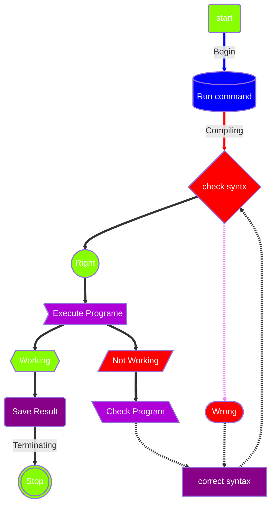
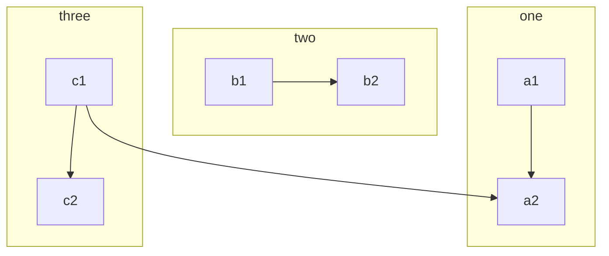
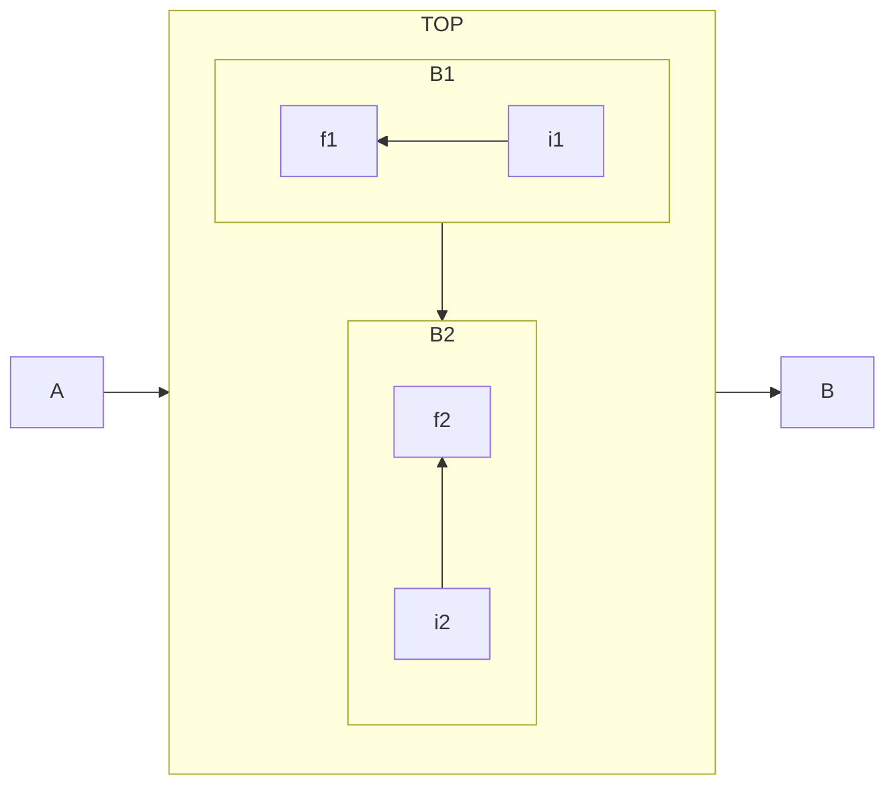

# Mermaid _ Flowchart



# Subgraphs

# Direction in subgraphs

#  clickable flow chart
```mermaid
flowchart LR
    A-->B
    B-->C 
    C-->D 
    click A callback "Tool tip for a call back"
    click B "https://www.github.com" "This is a tooltip for a link."
    click A call callback() "Tool tip for a callback"
    click B href "https://www.github.com" "This is a tooltip for a link"
 ```
 
