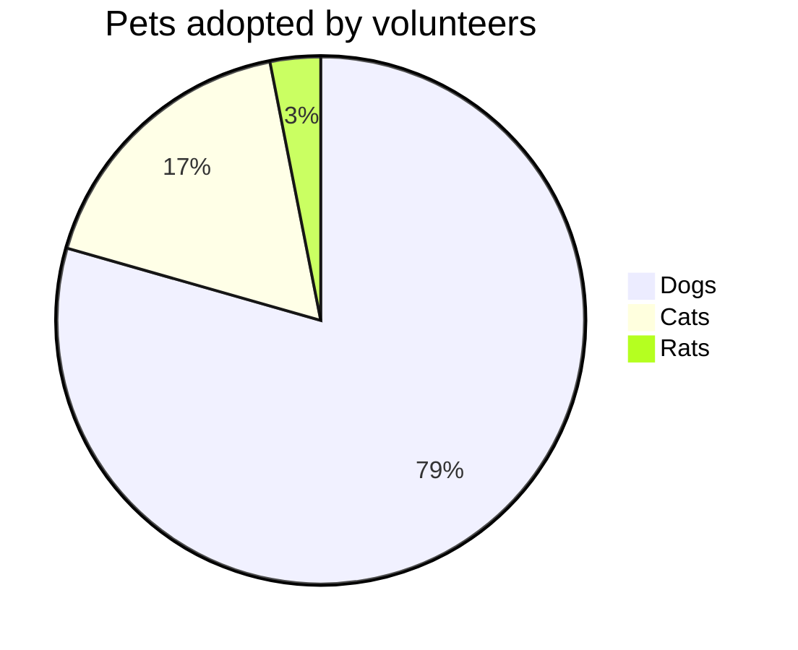

# PI CHART MERMAID DIAGRAM

## Syntax

- Start with `pie` keyword to begin with diagram.
- `showData` to tender the actual data after the legent text. 💡 Optional
- Followed by `title`  keyword and its value in string to give a title to the pie-chart. This is 💡  OPTIONAL.
- Followed by `dataSet` . Pie slices will be ordered clockwise in the same order as the labels.
  - label for a section in the pie diagram within `" "` quotes.
  - Followed by `:`  colon as separator.
  - Followed by `positive numeric value`  (supported up to two decimal places)

  [pie] [showData] (OPTIONAL) [title] 
  [titlevalue] (OPTIONAL) "[datakey1]" : 
  [dataValue1] "[datakey2]" : [dataValue2] "
  [datakey3]" : [dataValue3] . .

  ### Example

  ```mermaid
  pie showData
      title Key elements in product X
      "Calcium"  : 42.96
      "Potassium": 50.05
      "Magnesium": 10.01
      "Iron"     : 5
  ```
### Example 2



