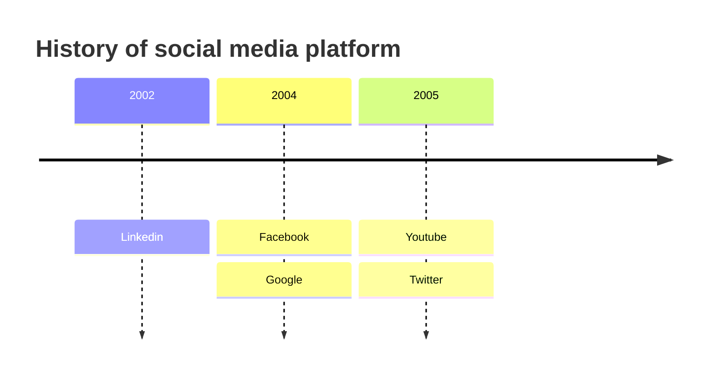

# Timeline Diagram

"A timeline is a type of diagram used to 
illustrate a chronology of events, dates, 
or periods of time. It is usually presented 
graphically to indicate the passing of time, 
and it is usually organized chronologically. 
A basic timeline presents a list of events
in chronological order, 
usually using dates as markers.
A timeline can also be used to show the 
relationship between events, such as the 
relationship between the events of a person's life"

### Example 1

