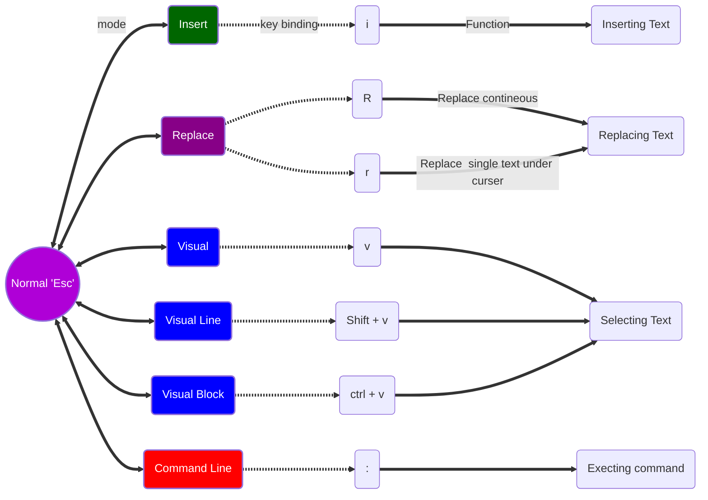

# VIM (nVIM)[^1] 
Vim is a modal editor.

 

- **`u`** : Undo in VIM   
- **`ctrl+r`** :Redo  

---

## Vim Tutorial 

Start the program by typing :`vim`
- **`vim filename.md`**      : Open a file for viewing and editing.
- **`q`** : quit file if we are not made any changes
- **`q!`** : quit file without saving any changes
- **`w`** :write/save the file with changes
- **`wq`** :save and quit the file
---
<h4  style="color:red;">**NORMAL MODE**</h4>
### NORMAL MODE

- **`x`**  :Delete a Text
  **_NAVIGATION_**
- **`h`** :Move  left
- **`j`** :Move Down
- **`k`** :Move up
- **`l`** :Move Right
- **`w`** :Move forward by one word
- **`W`** :Move forward by one word ignoring special character
- **`b`** :Move backward by one word
- **`B`** :Move backward by one word ignoring Special character
- **`e`** :Move end of the word
- **`$`** :Move end of  the line
- **`99l`** :Move end of the line
- **`0`** :Move beginning of the line
- **`99h`** :Move beginning of line
- **`^`** :Move first non empty character of the line
- **`ctrl+u`** :Move up
- **`ctrl+d`** :Move down
- **`gg`** :Jump to the First line in Document
- **`G`** :Jump to the  last line in Document
- **`<linenumber>G`** :To go to particular line number.
- **`1%`** :Move to top of document
- **`100%`** :Move to bottom of Document
- **`L`** :Move Lowest line of Screen
- **`M`** :Move middle of  screen
- **`H`** :Highest line of screen
- **`f<char>`** :Find:- you are in a line want to move to word “owl” you need to press in normal mode: `fo`
- **`F<char>`** :For Backward Search
- Similarly you can you `t` and `T` just  before the letter, forward and backward respectively.
- **`zt`** :Move current line to top of screen.

---

<h4 style="color:red;">**INSERT MODE**</h4>
### INSERT MODE 

- **`i`** :To Enter into insert mode.
- **`Esc`** : Back to Normal Mode

#### EDITING COMMANDS IN NORMAL MODE  AND PUT INTO INSERT MODE

- **`o`** :Opens a newline below my cursor
- **`O`** :Opens a new line above cursor.
- **`a`** :Append insert mode after character
- **`A`** :Append insert mode end of line
- **`I`** :Append insert mode beginning of line
- **`.`** :Repeat  previous edited command

---

#### Delete key `d` Binding with movement commands.  

- **`dw`** :Delete the word
- **`dd`** :Delete line
- **`de`** :Delete to end of word
- **`<Line number> D`** :_When cursor is beginning of  line_ : Delete that number of line :**you may paste later**
- **`999D`** :Delete Everything
- **`Y`** :yanks entire line
- **`D`** :Delete from cursor to end of line.
- **`C`** :change from cursor to end of line.

---

### CHANGE COMMAND : `c`  followed by bind and put you in insert mode.  
⚡Motion Arguments   

- **`ce`** :Change up to end of the word.
- **`cc`** :Delete the line and then insert mode
- **`cw`** :Change  the word, while cursor is on first letter.
- **`ciw`** :Change the word , irrespective of cursor position on word
- **`x`** :Delete that particular character
- **`r`** :Replace  that particular character
- **`~`** :Change the case of Single Character
- **`R`** :Replace until pressing `Esc`

---

### COPY AND PASTE 

- **`y`** :Copy take motion as argument
- **`yy`** :Copy the line 
- **`yw`** :copy  the word
- **`2y`** :Three line copied/yanked
- **`p`** :Paste below the line.
- **`P`** :Paste above the line.

---

### COMMAND LINE MODE

- **`:`** :Enter in to command line mode
- **`Esc`** :Back to normal mode
🪴 **After pressing `:` in normal mode, you and type and enter the command**

- **`q`** :quit
- **`w`** :Save document
- **`:help :w`** :To find help for _w_ key.
- 🇮🇳 Vim has Separate tabs and windows.
- **`:tabnew`** : Opening  a new tab
- **`:q`** :Closing a tab
- **`:qa`** :Closing alll windows
- **`ꜛ`** :Show previous command

---

### VISUAL MODE **REGULAR** `v` 

💡 Use  Regular/Normal mode commands to move your pointer for Selection.
💡 Upon Selection, Press `y`: it copies your selection and put you back to normal mode.

- **`i"`** :To select text with in double  quotes.
- 🌲 In visual mode when we yank the text between ".
- 🌲 We cannot paste  same text more than once as every time we paste new text saved in buffer.

### VISUAL LINE MODE **`V`**

- Select  whole line

### VISUAL BLOCK MODE **`ctrl+v`**
Select block of character as a column. 📓 When press `I` insert mode, when we write something new,
when we write something new, it changes in all the block at once:
  - **`I`** :Insert to the left of visual block.
  - **`A`** :Appends to the right of visual block.
  - **`c`** :Change  visual block.
  - **`d`** :To delete Visual Block
  - **`o`** :Change Corner of visual Block

  ---
  ### COUNTS
- **`4j`** :it does j 4 times.
- **`7dw`** :Delete 7 words

---
### MODIFIER (i : i for in)

  - **`ci[`** :_[strong word]_ :Put me insert mode after deleting every thing inside  bracket.
- **`da[`** :Deleting everything including bracket
- **`ciw`** :change word, irrespective of cursor position.
- **`yi(`** :Yank everything with in bracket. **_This also works for tags._**

---

### INDENT, REPEAT AND TAB

⚡: It follows the <number> <verb>  <noun>  rule. [NORMAL MODE]

- **`>h`**  or **`> l`** :  Indent right and left respectively.
- **`>>`** : Indent current line Right
- **`<<`** : Out dent or Indent current line left
- **`>j`** : Indent current line and line below
- **`2>2j`** :Indent 4 lines.
- **`.`** :Repeat command of Insert  mode.
- 🌴 **IN  VISUAL MODE WE NEED  TO PRESS  `>` ONE TIME FOR INDENT**
- 💡 **IN INSERT MODE PREE `TAB` KEY**
- **`^I`** : is the tab character. [Set list]

---
### AUTO FORMAT

- **`vi{`** and **`==`** : Auto format and indent.
- **`==`** :Press after selecting lines for auto indent.

---
###  SEARCH

- **`*`** :Search for the word the cursor is on
- **`n`** :To find next occurrence
- **`N`** :To find next occurrence in backward direction.
- **`#`** :Backward search for  the word  cursor is on
- **`:/searchword`** :all the search word highlighted
- **`:?searchword`** :Search upward
- **`:/\cdatabase`** :Ignore case
- **`:/\Cdatabase`** :Case sensitive search.
- **`:\/<in\>`** :Search perticular word
- **`:/\/\*\*`** :Search for special character.
- **`:/↑`** :Show previous search
- **`:?↑`** :Show previous search in reverse order.
- **`q/`** :Show search history.
- **`q?`** :Show search history in reverse order
- **`:q`** :Quit out of this
- **`q:`** :Show the command history

---

### SEARCH AND REPLACE 

- **`:4,7s/two/VIM`** :From line 4 to 7 search word "two" and replace with "VIM". Works **_in first oczcurance_** of each line.
- **`:4,7s/two/VIM/g`** :From line 4 to 7 search word "two" and replace with "VIM". Works in **_First Occurrence_** of each line **Global**
- **`:4,7s/two/VIM/gi`** : From line 4 to 7 search word "two" and replace with "VIM". Works in **_First Occurrence_** of each line **_global_**
- **`:4.7s/two/VIM/gI`** :From line 4 to 7 search word "two" and replace with "VIM". Works in **_First occurrence_**  of each line **_Global_** and **_Force case sensitive_**
- **`:4,7s/two/VIM/gic`** :From line 4 to 7 search word "two" and replace with "VIM". Works in **_First  Occurrence_** of each line **_Global_**, **_case insensitive_** and  **_query for change_**.
- **`%s/two/VIM`** :**_Any where_** In the document search for "two" and replace with "VIM".

---

### PAGING, HIGH LOW MIDDLE, SCROLL OFFSET

- **`ctrl + f`** :One page forward
- **`ctrl + b`** :one page backward
- **`3 ctrl f`** :Three pages forward
- **`ctrl+d`** :Half of page Down
- **`ctrl+u`** :Half of page up
- **`H`** :Highest line of the page
- **`L`** :Lowest line of the page
- **`M`** :Middle line of the page
- **`zt`** :taking current line to top of screen

---

### LINE INFO, PASTE, VIEW, EDIT, JOIN, SORT

- **`ctrl + g`** :Show current file name.
- **`:w newfilename.txt.backup`** :creating backup file
- **`:view filename`** :Open As read only
- **`e filename`** :Edit  fille
- **`J`** :Join below line to current line
- **`3J`** :Join below three lines to current line.
- **`:r filename`** :join another file to current file at cursor

---

### SORT LINES

- **`10,19sort`** :Sort lines from 10 to 19.
- **`10,19sort!`** :Sort lines from 10 to 19 in reverse order
- **`:%sort`** :Sort Every line in the file

---
### CHANGE LIST, JUMP LIST

- **`g;`** :go to last (previous change)
- **`g,`** :go forward to last change
- **`:changes`** :To See whole list of changes
- **`:jumps`** :Jump list
- **`ctrl + o`** :Takes to previous jump
- **`ctrl + i`** :Takes to forward jump

---
## MARKS

**🪴 Consider mark as book mark**

- **`ma`** :Set mark `a`. 🌴 My Bookmark is letter `a` and is on the character where cursor is present.
- **`'a`** :go to the line with mark `a`.
- **``a`** :go to the mark in the line marked.
- **`['`** :go to previous  line  mark
- **`]'`** :go to next line mark
- **`:marks`** :To see the visible marks
- **`mA`** :Set uppercase A. 💡 Uppercase  mark behave as lower case as long as we are on same file.
- **`'A`** :Takes to the file where uppercase letter is marked.
- **`:delmarks a-z`** or **`:delmarks a,A`** or **`delmarks!`** : delete marks

---
### FIND IN A LINE

- **`fr`** :Find `r`
- **`Fr`** :Find `r` in opposite direction.
- **`tr`** :Go left of letter `r`
- **`Tr`** :Go right of letter `r`
- **`dt.`** :Delete upto period
- **`d/input`** :Delete from cursor to `input`
- **`d?filename`** :Delete from cursor to filename (Right to left)

---
## BUFFERS

⚡  Buffer is a just a space in ram memory

- **`:buffers` or `:ls`** :To see all the opened buffers
- `:bp` : buffer previous
- `:bn` : buffer next
- `:set hidden` : no warning for unsaved document.
- `b4` : just buffer 4
- `bd`: To close the buffer
- `e!`: remove all changes
- `:q`: quit all buffers

---
## WINDOWS

- **`:sp`** : split window horizontally 
- **`Ctrl w w`** : switch to next window
- **`:q`** : close the window.
- **`:vsp`** : vertical split window
- **`Ctrl w s`** : split the window
- **`Ctrl w v`** : split window vertically
- **`vsp filename`** : open different fine in  vertical window.
- **`Ctrl w x`** : exchange the window
- **`:set splitright`** : new windows in right
- **`Ctrl w r`** : rotate window
- **`Ctrl w R`** : rotate window in reverse direction
- **`Ctrl w t`** : go to top left window
- **`Ctrl w b`** : go to bottom right window
- **`Ctrl w p`** : previous window
- **`Ctrl w h`** : left window
- **`:resize 20`** : change selected window size to 20
- **`vertical resize -10`** : change selected window vertical.
- **`Ctrl w =`** : make all windows to same size.
- **`Ctrl w _`** : maximise the height
- **`Ctrl w |`** : maximise the width
- **`Ctrl w o`** : To see single split window
- **`:ba`** : show all buffers horizontally 
- **`: vert ba`** : show all buffers vertically
- **`:vsp | b3`** : current and buffer3
- **`:help ctrl-w`** : to see all the commands
---
## TABS

- **`:tabe vtpim`** : open file in new tab.
- **`:tabn`** : go to next tab.
- **`:tabp`** : go to previous tab.
- **`:tabn 3`** : go to tab no 3.
- **`gt`** : go to next tab.
- **`gT`** : go to previous tab.
- **`:tabnew`** : open new blank tab
- **`:tabm`** : move my tab to right
- **`:tabm 3`**: move to 3 position
- **`:q` or `:tabclose`** : to close the single tab
- **`:tab ball`** : to open all buffers in tab.
- **`:tabonly`** : close all other tabs.
- **`:tabclose 3`** : close tab 3
- **`:tabe samefile`** : open same file in different tab.
- **`:drop file2`** : it open file2 and drop current file.
- **`:tab split`** : open a window in tab.
- **`Ctrl w T`** : open a window in tab
- **`:qa`** : close all my tabs

---
### FOLDING TEXT(Hiding the lines)

- **`:set foldmethod`** or **`set fdm`** : To see current foldmethod.
- 💡 Select the lines which we want to hide.
- **`zf`** :Create fold
- **`zo`** :open fold
- `zc` : close the fold
> To save fold 
> `mkdir ~/.vim`
> `mkdir ~/.vim/view`
> `:mkview`

🪴 When you open a file.
`:loadview`

- **`zd`** :Delete fold
- **`zf10j`** :Fold up next 10 lines and the line on which cursor present.🌴 Total 11 lines
- **`zf10k`** :Fold up previous 10 lines
- **`:148, 158fold`** :Fold from 148 to 158
- **`:,+10fo`** :Fold from current position to 10 line below.
- **`zfa{`** :Fold text in {}
- **`zn`** :Open all the folds
- **`zN`** :set all the folds as they were before
- **`:%foldopen`** :open all the folds
- **`:%foldclose`** :close all the folds
- **`zj`** :jump to next fold
- **`[z`** :jump to top off current fold
- **`]z`** :jump to bottom of current fold
- **`zk`** :jump to previous fold
- **`zE`** :Eleminate all the fold
💕  **_For Nested fold_**  

- **`zO`** : open all nested folds.
- **`:set fdm indent`** : indented fold method
- **`zC`** : close all the nested folds.
- **`zr`** : reduce all folds one level. (Same as `zo` for all folds.
- **`zR`** : Open all the folds.
- **`zm`** : close all the fold at a time.
- **`zM`** : Fold up all the folds.
---
📓 **VARIOUS FOLD METHODS**
1. Manual
2. Indent
3. Syntax
4. Expr(regex/regular expression)
5. Maker
6. Diff
---
## REGISTERS

- **`p`** : paste right side (normal mode) from default register.
- **`P`** : paste left side (normal mode) from default register.
- **`Ctrl r “`** : paste from default register (insert mode)
>**Registers we can yank in to are : `a-z`.** 

- **`“ayiw`** : yank in word to register a.
- **`“ap`** :paste from register a (normal mode)
- **`Ctrl r a`** : paste from register a (insert mode)
- 
- **`“by`** : yank into register b (visual mode).
 > **To replace the test in visual mode, go to line, `ctrl v` for visual mode, select text, press `c` for change, this will put us in insert mode, `ctrl r b` paste from register b in insert mode.**  
 - **`“Ayiw`** : it will append in the data present in register a.

### SPECIAL REGISTERS

- `:register` or `:reg`: to see what inside register.
 
- **`“/`** : special register for path directory
- **`“%`** : special register for document name.
- **`“:`** : special register for last command we typed.
- **`“”`** : default register
- **`“0`** : yank text register
- **`“-`** : delete register
- **`“1`** : deleteing line. 
 >**Deleted lines will be stored up to register 9** 
 >> **_you can check ~/.viminfo file for registers_** 
---
## MACRO

🪴 Record and play sequence of events.

> `q register letter` :start recording a macro into that register.
> press `q` stop recording
> press `@` to play your macro.

- **`qm`** : start recording macro for register m
- **`q`** : quit recording
- **`@m`** : run macro which stored in register m.
- **`3@m`** : run macro 3 times.

---
### NUMBERS

- when we put cursor on number or left of number and press `ctrl a` it will increment by 1.

- when we put cursor on number or left of number and press `ctrl C ` it will decrement  by 1.

- **`5 ctrl a`** : increment by 5
- **`“ap`** : to print out macro a.

---

### DICTIONARY

- **`:set spell`** :Turn on vim spell check
- **`:set nospell`** :Turn of vim spell check
- **`z=`** :Bring up suggested Replacement
- **`]s`** :Jump to next miss spelled word
- **`[s`** :Jump to previous miss spelled word
- **`zg`** :**Good Word** : Add word under cursor to the dictionary
- **`zw`** :Whoops!, Undo and remove the word from the dictionary

